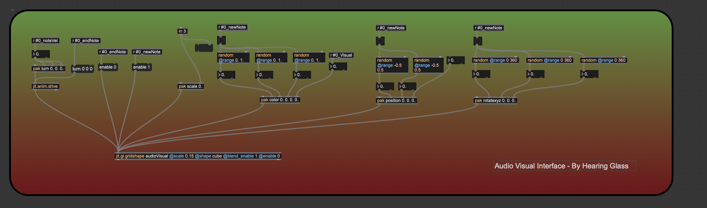
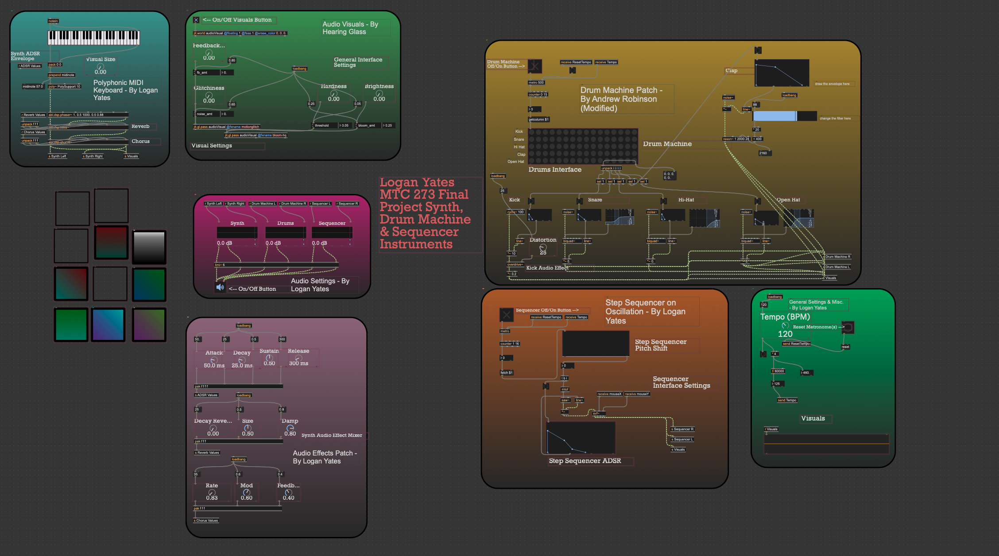

# Synth, Sequencer & Drum Machine Instrument Patch  
#### By Logan Yates — MTC 273, Spring 2026 Final Project

## Overview

This project consists of three primary instruments built in Max MSP 9: a polyphonic MIDI synthesizer, a step sequencer, and a drum machine. Each component was designed from scratch and integrated into a shared audio and visual system. The project explores sound synthesis, sequencing, and real-time interaction through the use of oscillators, envelopes, filters, effects, and audiovisual processing.

## Section 1: Patches

### 1.1 Polyphonic Synth MIDI Keyboard Patch - By Logan Yates

This patch allows the user to perform notes using a virtual MIDI keyboard. It supports polyphony, meaning multiple notes can be played simultaneously. MIDI note and velocity data are processed and routed into the synthesis engine, while also being sent to the effects chain and visual system.

#### Components:
* **Kslider:** Provides a visual MIDI keyboard interface.
* **Notein:** Receives MIDI note and velocity data.
* **Poly~ (Polyphonic Routing):** Enables multiple simultaneous voices.
* **MIDI Note Formatting (Midinote / Pack):** Structures note and velocity data.
* **Send Objects (s Synth Left/Right):** Routes audio output to the mixer.
* **Reverb & Chorus Chains:** Add spatial depth and modulation to the synth signal.

### 1.2 Main Audio Interface / Synth Engine - By Logan Yates

This patch functions as the core synthesis engine for the polyphonic synthesizer. It converts MIDI notes into sound using oscillators and shapes them with an ADSR envelope. It also manages note-on and note-off events while sending signal data to the visual system.

#### Components:
* **Mtof:** Converts MIDI note values into frequency values.
* **Cycle~ Oscillators:** Generate waveform-based sound.
* **ADSR~:** Shapes amplitude over time.
* **Unpack / Scale:** Separates and adjusts incoming MIDI data.
* **Route & Select:** Handles note-on and note-off logic.
* **Snapshot~:** Sends sampled audio data to the visual system.
* **Send (#0_Visual):** Passes signal data to visualization patches.

### 1.3 Audio Effects Patch - By Logan Yates

This patch applies audio effects such as reverb and chorus to the synthesized sound. It provides real-time control over parameters including decay, size, damping, modulation rate, and feedback.

#### Components:
* **ADSR Controls:** Adjust attack, decay, sustain, and release globally.
* **Reverb Controls (Decay, Size, Damp):** Shape the spatial character of the sound.
* **Chorus Controls (Rate, Mod, Feedback):** Add movement, width, and modulation.
* **Pak Objects:** Bundle parameter values for processing.
* **Loadbang:** Initializes default settings when the patch loads.

### 1.4 General Settings & Tempo Patch - By Logan Yates

This patch manages global timing and system-wide controls. It defines the master tempo in BPM, resets timing systems, and sends synchronization signals to the sequencer and drum machine.

#### Components:
* **Live.dial (Tempo):** Controls the master BPM.
* **Metro Timing System:** Converts BPM into timing intervals.
* **Send Tempo / ResetTempo:** Distributes timing and reset signals across patches.
* **Visualizer Output:** Displays waveform data from the overall system.

### 1.5 Drum Machine Patch - By Andrew Robinson (Modified by Logan Yates)

This patch generates rhythmic patterns through a step-based drum sequencer. Each row corresponds to a different drum sound, and steps can be enabled or disabled to create rhythmic patterns.

#### Components:
* **Metro & Counter:** Drive the sequencing clock.
* **Matrixctrl:** Provides a grid interface for drum pattern creation.
* **Kick (Cycle~ + Overdrive~):** Generates low-frequency kick drum sounds.
* **Snare & Hi-Hat (Noise~ + Filters):** Create percussive textures.
* **Function & Line~:** Shape the amplitude envelopes of drum hits.
* **Filtergraph~:** Adjusts tonal shaping and filtering.
* **Send (Drum Machine L/R):** Routes drum audio to the mixer.

### 1.6 Step Sequencer (Oscillation-Based) - By Logan Yates

This patch generates melodic sequences using oscillators. Each step in the sequence determines pitch, which is converted into frequency and played automatically in sync with the global tempo.

#### Components:
* **Multislider:** Defines pitch values for each step.
* **Counter:** Advances through the sequence step by step.
* **Fetch $1:** Retrieves the currently active step value.
* **Mtof:** Converts pitch values into frequency.
* **Saw~ Oscillator:** Produces the raw sequencer tone.
* **ADSR Envelope:** Shapes the contour of each note.
* **SVF~ Filter:** Controls tone, resonance, and brightness.

### 1.7 Audio Mixer & Output Patch - By Logan Yates

This patch combines all audio sources and routes them to the final output. Each instrument has an independent volume control, allowing the user to balance the synthesizer, drums, and sequencer.

#### Components:
* **Live.gain~:** Controls volume for the Synth, Drums, and Sequencer.
* **Receive Objects (r Synth/Drums/Sequencer):** Collect incoming audio signals.
* **Limiter:** Prevents clipping and excessive output levels.
* **Ezdac~:** Sends final audio to the speakers or headphones.

### 1.8 Audio Visual System - By Hearing Glass (Integrated by Logan Yates)

This patch generates real-time visuals based on incoming audio signals. Parameters such as brightness, glitching, and feedback respond dynamically to the sound being produced.

#### Components:
* **jit.world:** Initializes the OpenGL rendering environment.
* **jit.gl.pass:** Applies visual processing effects such as bloom.
* **Audio Input Mapping:** Converts sound into visual control data.
* **Random Generators:** Add variation to movement and color.
* **Controls (Brightness, Hardness, Glitch):** Adjust the visual response.

### 1.9 PolySupport Subpatch: Synth Voice Architecture - By Logan Yates

This subpatch handles the individual voice logic for the polyphonic synthesizer. It receives MIDI input and converts it into audio using multiple oscillators, including `cycle~` and `saw~`, layered together to create a richer tone. It also generates the visual trigger and velocity data used by the rendering engine.

#### Components:
* **Oscillator Bank:** Combines three `cycle~` objects and one `saw~` object to create a layered synth sound.
* **Mtof:** Converts MIDI note numbers into oscillator frequencies.
* **ADSR~:** Provides amplitude shaping so notes begin and end smoothly.
* **Snapshot~:** Periodically samples the signal for use in the visual system.
* **Send (#0_newNote / #0_endNote):** Triggers visual events when notes begin and end.

### 1.10 PolySupport Subpatch: Audio Visual Interface - By Hearing Glass

Located within the `polySupport` patch, this section determines how individual notes are visualized. It uses randomization to create variation in color, position, scale, and motion so that each note produces a unique visual response.

#### Components:
* **jit.gl.gridshape:** Renders a 3D object for each active note.
* **jit.anim.drive:** Controls movement and rotation of visual objects.
* **Random (@range):** Generates variation in RGB color, position, and rotation.
* **Pak Scale:** Adjusts the size of each visual element based on MIDI velocity.
* **Enable 0/1:** Activates visuals on note-on and disables them on note-off to optimize performance.

## Section 2: Presentation and Edit Views

The presentation view consolidates all major patches into a single performance-oriented interface. It allows the user to interact with the synthesizer, sequencer, drum machine, effects, and visuals in real time through a simplified layout.

The edit view reveals the internal structure of the main patch, showing how objects are arranged, connected, and routed behind the scenes. This view provides a clearer understanding of the full system architecture and signal flow.

## Credits & Citations

* **Audio Visual System:** Hearing Glass
* **Drum Machine Architecture:** Andrew Robinson
* **System Design & Implementation:** Logan Yates

## References

The following sources informed the development and design of this project in Max MSP 9:

* Cycling '74 Forums. “How to Make Hand Clapping Sound.” *Cycling '74 Forums*, [https://cycling74.com/forums/how-to-make-hand-clapping-sound](https://cycling74.com/forums/how-to-make-hand-clapping-sound). Accessed 2 May 2026.
* XFade. “Max Examples.” *XFade*, [https://www.xfade.com/max/examples/](https://www.xfade.com/max/examples/). Accessed 4 May 2026.
* Hearing Glass. “Audiovisual Synth Basics | Max/MSP Tutorial.” *YouTube*, [https://www.youtube.com/watch?v=qiPpO9jW6qQ&t=2352s](https://www.youtube.com/watch?v=qiPpO9jW6qQ&t=2352s). Accessed 2 May 2026.
