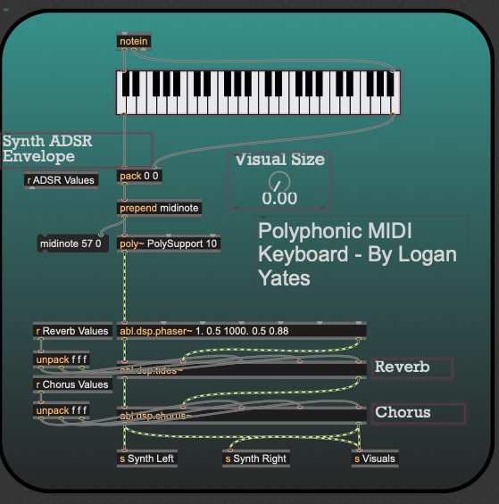
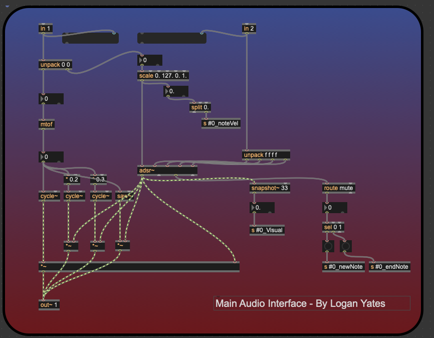
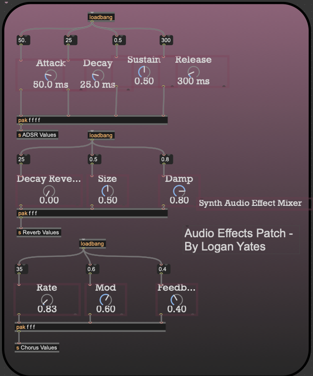
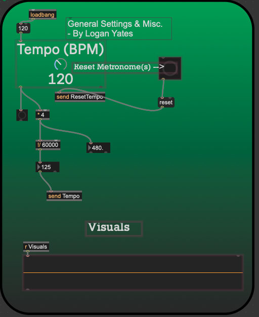
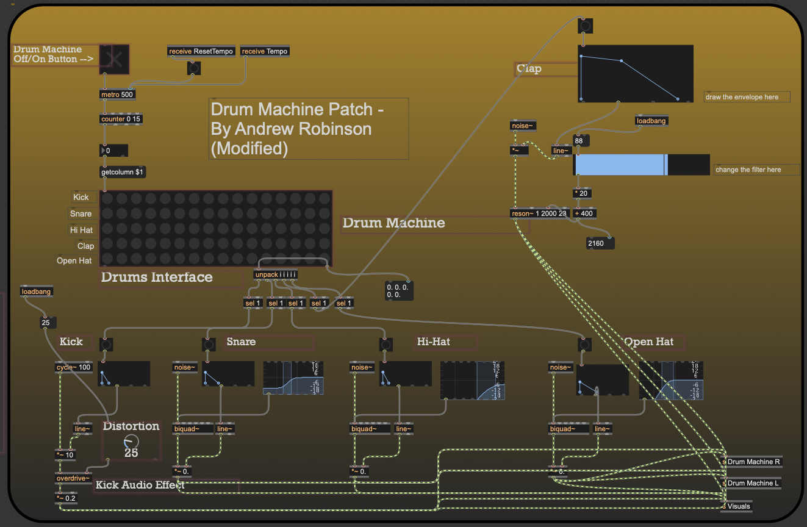
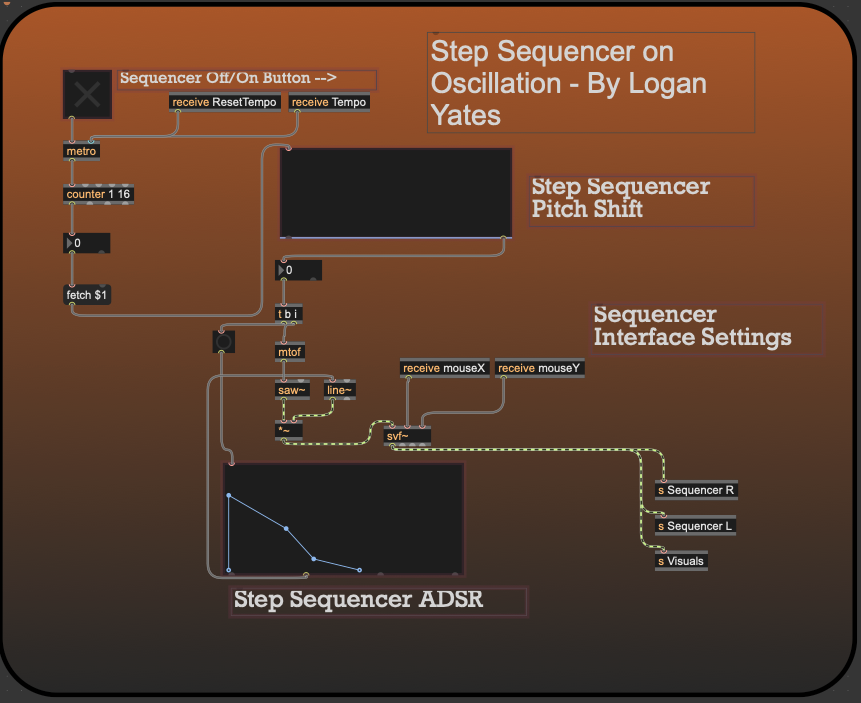
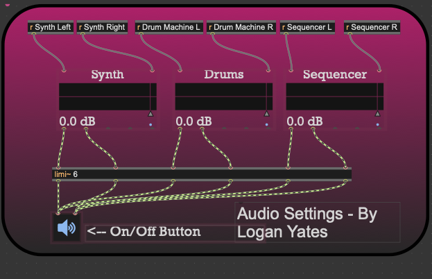
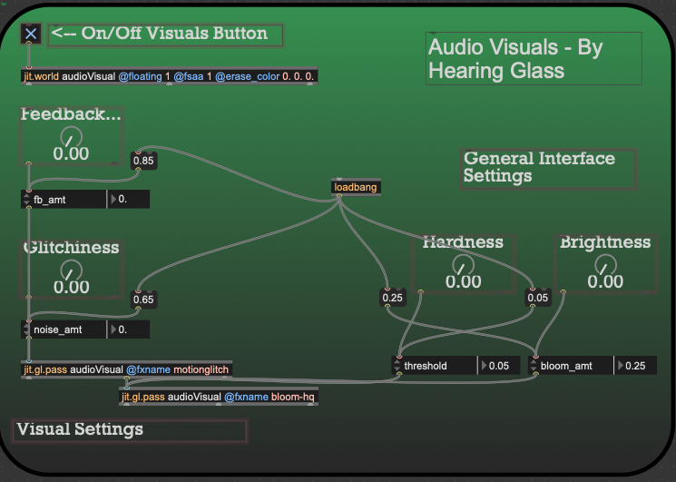
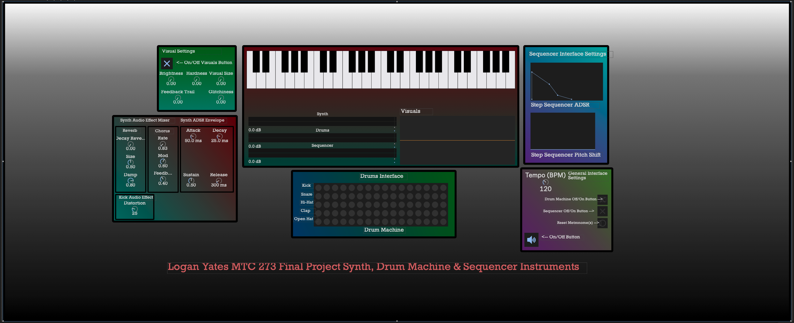

# Synth, Sequencer & Drum Machine Instrument Patch  
#### By Logan Yates MTC 273 – Spring 2026  (Final Project)

## Overview  

This project includes three main instruments built in Max MSP 9: a polyphonic Synth MIDI piano, a step sequencer, and a drum machine. Each component is designed from scratch and interconnected through a shared audio and visual system. The project explores sound synthesis, sequencing, and real-time interaction using oscillators, envelopes, and audio effects.  

---

## Section 1: Patches  

### 1.1 Polyphonic Synth MIDI Keyboard Patch - By Logan Yates  

This patch allows a user to play notes using a virtual MIDI keyboard. It supports polyphony, meaning multiple notes can be played at once. MIDI note and velocity data are processed and routed into the synthesis engine, while also being sent to effects and visuals.  

  

#### Components:  
* **Kslider:** Provides a visual MIDI keyboard interface.  
* **Notein:** Receives MIDI note and velocity data.  
* **Poly~ (Polyphonic Routing):** Enables multiple simultaneous voices.  
* **MIDI Note Formatting (Midinote / Pack):** Structures note and velocity data.  
* **Send Objects (s Synth Left/Right):** Routes audio output to the mixer.  
* **Reverb & Chorus Chains:** Adds spatial and modulation effects to the synth signal.  

---

### 1.2 Main Audio Interface / Synth Engine - By Logan Yates  

This patch is the core synthesis engine for the piano. It converts MIDI notes into sound using oscillators and shapes them with an ADSR envelope. It also routes note-on and note-off events and sends visual data.  

  

#### Components:  
* **Mtof:** Converts MIDI notes into frequency values.  
* **Cycle~ Oscillators:** Generate waveform-based sound.  
* **ADSR~:** Shapes amplitude over time.  
* **Unpack / Scale:** Separates and adjusts incoming MIDI data.  
* **Route & Select:** Handles note-on/off logic.  
* **Snapshot~:** Sends audio data to the visual system.  
* **Send (#0_Visual):** Passes signal data to visualization patches.  

---

### 1.3 Audio Effects Patch - By Logan Yates  

This patch applies audio effects such as reverb and chorus to the synthesized sound. It allows real-time control over parameters like decay, size, modulation rate, and feedback.  

  

#### Components:  
* **ADSR Controls:** Adjust attack, decay, sustain, and release globally.  
* **Reverb Controls (Decay, Size, Damp):** Shape spatial characteristics.  
* **Chorus Controls (Rate, Mod, Feedback):** Add movement and width.  
* **Pak Objects:** Bundle parameter values for processing.  
* **Loadbang:** Initializes default settings on load.  

---

### 1.4 General Settings & Tempo Patch - By Logan Yates  

This patch manages global timing and system-wide controls. It defines the tempo (BPM), resets timing systems, and sends synchronization signals to sequencers and drum machines.  

  

#### Components:  
* **Live.dial (Tempo):** Controls BPM.  
* **Metro Timing System:** Converts BPM into timing intervals.  
* **Send Tempo / ResetTempo:** Distributes timing signals across patches.  
* **Visualizer Output:** Displays waveform data.  

---

### 1.5 Drum Machine Patch - By Andrew Robinson (Modified by Logan Yates)  

This patch generates rhythmic patterns using a step-based drum sequencer. Each row corresponds to a drum sound, and steps can be toggled to create patterns.  

  

#### Components:  
* **Metro & Counter:** Drives sequencing timing.  
* **Matrixctrl:** Grid interface for drum pattern creation.  
* **Kick (Cycle~ + Overdrive~):** Generates low-frequency drum hits.  
* **Snare & Hi-Hat (Noise~ + Filters):** Creates percussive textures.  
* **Function & Line~:** Shapes amplitude envelopes for each hit.  
* **Filtergraph~:** Adjusts tonal shaping of drum sounds.  
* **Send (Drum Machine L/R):** Routes audio to the mixer.  

---

### 1.6 Step Sequencer (Oscillation-Based) - By Logan Yates  

This patch generates melodic sequences using oscillators. Each step in the sequence determines pitch, which is converted to frequency and played automatically in sync with the global tempo.  

  

#### Components:  
* **Multislider:** Defines pitch values for each step.  
* **Counter:** Steps through the sequence.  
* **Fetch $1:** Retrieves the active step value.  
* **Mtof:** Converts pitch to frequency.  
* **Saw~ Oscillator:** Produces the sequencer sound.  
* **ADSR Envelope:** Shapes each note.  
* **SVF~ Filter:** Controls tone and brightness.  

---

### 1.7 Audio Mixer & Output Patch - By Logan Yates  

This patch combines all audio sources and outputs them to the speakers. Each instrument has independent volume control.  

  

#### Components:  
* **Live.gain~:** Controls volume for Synth, Drums, and Sequencer.  
* **Receive Objects (r Synth/Drums/Sequencer):** Collects audio signals.  
* **Limiter:** Prevents clipping.  
* **Ezdac~:** Outputs final audio to speakers.  

---

### 1.8 Audio Visual System - By Hearing Glass (Integrated by Logan Yates)  

This patch generates real-time visuals based on audio signals. Parameters such as brightness, glitch, and feedback respond dynamically to sound input.  

  

#### Components:  
* **jit.world:** Initializes the OpenGL rendering environment.  
* **jit.gl.pass:** Applies visual effects such as bloom.  
* **Audio Input Mapping:** Converts sound into visual parameters.  
* **Random Generators:** Adds variation to motion and color.  
* **Controls (Brightness, Hardness, Glitch):** Adjust visual response.  

---

## Section 2: Presentation View  

The presentation view consolidates all patches into a single user interface. It allows users to interact with the piano, sequencer, drum machine, and effects in real time.  

  

---

## Credits & Citations  

* **Audio Visual System:** Hearing Glass  
* **Drum Machine Architecture:** Andrew Robinson  
* **System Design & Implementation:** Logan Yates  

## References

The following sources informed the development and design of this project in Max MSP 9:

* Cycling '74 Forums. “How to Make Hand Clapping Sound.” *Cycling '74 Forums*, [https://cycling74.com/forums/how-to-make-hand-clapping-sound](https://cycling74.com/forums/how-to-make-hand-clapping-sound). Accessed 2 May 2026.

*  XFade. “Max Examples.” *XFade*, [https://www.xfade.com/max/examples/](https://www.xfade.com/max/examples/). Accessed 4 May 2026.

* Hearing Glass. “Audiovisual Synth Basics | Max/MSP Tutorial.” *YouTube*, [https://www.youtube.com/watch?v=qiPpO9jW6qQ&t=2352s](https://www.youtube.com/watch?v=qiPpO9jW6qQ&t=2352s). Accessed 2 May 2026.